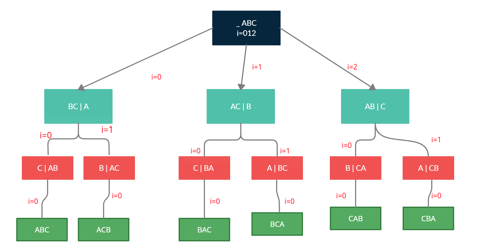

# Recursion
* Recursion time complexity
	1. if there is only one recursive call then time complexity will be O(n).
	2. if there are two recursive calls then time complexity will be O(2<sup>n</sup>).
* Recursion with loops ( deadly confusing combination )

Below is java program to print all permunation combinations.

permute("ABC","");

To understand how recursion with loop works; run below program and understnad output.



```
void permute(String str1,String str2)
{
	System.out.println("****"+str1+"****"+str2);
	if(str1.length()==0) //base condition
	{
		System.out.println(str2+">>>>>>>>>>>>>>>>>>>>>>>>>>>>>>>>>>");
	}
		
    for(int i=0;i<str1.length();i++)
    {
      System.out.println(i+"###"+str1+"###"+str2);
      char ch=str1.charAt(i);		
      String str3=str1.substring(0, i)+str1.substring(i+1, str1.length());
      String endStr="";

      if(i==0) System.out.println(i+"=>("+str3+")..("+str2+":"+ch+")"); else
      if(i==1) System.out.println(i+"=>("+str3+")&&("+str2+":"+ch+")"); else
      if(i==2) System.out.println(i+"=>("+str3+")^^("+str2+":"+ch+")");

      permute(str3,str2+ch);
    }
}
```
